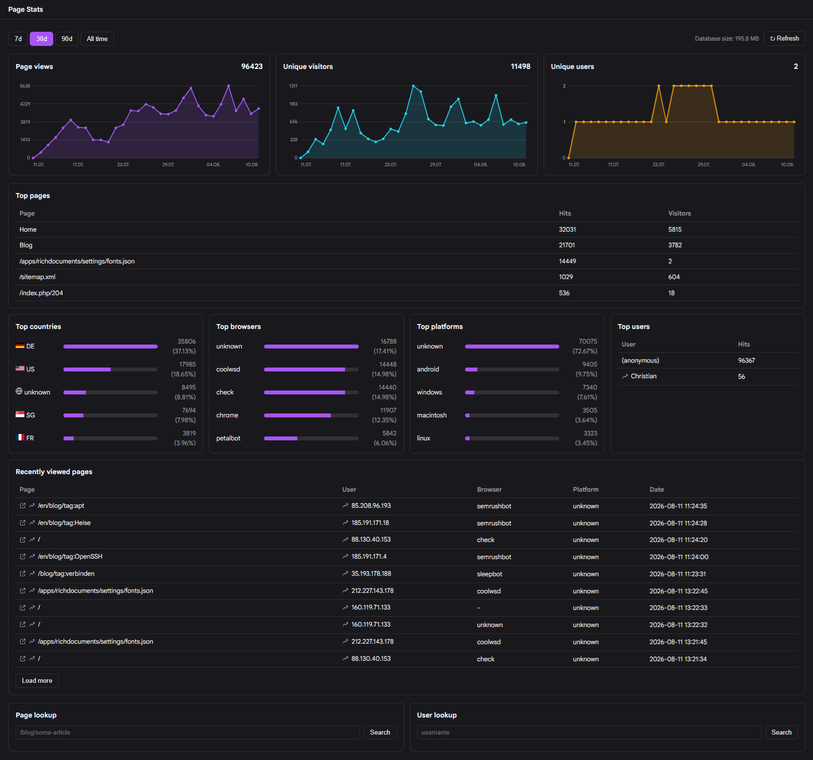

# Page Insights Plugin

[](https://codeberg.org/chschmidt/grav-plugin-page-insights/releases) 
[](https://de.wikipedia.org/wiki/MIT-Lizenz) 
[](https://translate.codeberg.org/engage/grav-plugin-page-insights/)  



The **Page Insights** Plugin is an extension for [Grav CMS](http://github.com/getgrav/grav).

Enhanced page and user analytics for Grav, with full support for both the classic Admin (Grav 1.7) and Admin2 (Grav 2.0).
This plugin adds an entry to the admin plugin sidebar showing detailed page and visitor statistics about your site.

Page Insights is an independent continuation of [Page Stats](https://github.com/francodacosta/grav-plugin-page-stats)
by Nuno Costa - see [`CONTRIBUTING.md`](CONTRIBUTING.md#project-history) for the full history.

## Documentation

This README covers the essentials. The full user/admin handbook - installation, every
configuration option, using the dashboards, storage & maintenance, geolocation, privacy &
security, and a FAQ - lives in the [Codeberg
wiki](https://codeberg.org/chschmidt/grav-plugin-page-insights/wiki), available in German and
English. Contributors looking to work on the plugin's code itself should start at
[`docs/README.md`](docs/README.md) instead.

## Features

* Page views, unique visitors, and unique users, with time-series trend charts
* Top pages, countries (with flags), browsers, platforms, and users
* Page Detail / User Detail views, each with their own time-series chart and top-lists
* "Recently viewed pages" with load-more pagination, browser/platform columns
* IP fallback for anonymous (non-logged-in) visitors, individually traceable via their IP
* Works with both the classic Admin (Grav 1.7) and Admin2 (Grav 2.0) side by side

## Installation

**Requirements:** Grav 1.7 or newer, PHP >= 8.0. Admin2 additionally requires the official `api`
plugin (Classic Admin works without it).

### Via GPM (recommended)

* **Admin panel:** *Plugins → Add* → search for "Page Insights" → Install.
* **CLI:**
  ```
  bin/gpm install page-insights
  ```

### Manual installation

1. Download the latest release from [Codeberg](https://codeberg.org/chschmidt/grav-plugin-page-insights/releases)
   and unzip it under `/your/site/grav/user/plugins`.
2. Rename the extracted folder to `page-insights` (if it isn't already named that).
3. Copy `user/plugins/page-insights/page-insights.yaml` to `user/config/plugins/page-insights.yaml`
   and only edit that copy - the file inside the plugin folder itself is overwritten on every
   update.

### First run

The first time a page is loaded after installation, the plugin automatically creates a new SQLite
database; its location can be defined in the plugin config and defaults to
`user/data/page-insights.sqlite`.

> **Coming from Page Stats?** Page Insights uses a separate database file by default, so running
> both plugins in parallel during a transition won't double-count hits. If you'd rather carry over
> your existing history than start fresh, copy (not move, in case you want to keep Page Stats
> installed too) your existing `user/data/page-data.sqlite` to the new
> `user/data/page-insights.sqlite` path before the first run. Full details, including GPM update
> behavior and database migrations, are in the wiki's
> [Installation](https://codeberg.org/chschmidt/grav-plugin-page-insights/wiki/en.Installation) page.

## Configuration

You can exclude individual pages from analytics via the page front matter:
```
---
page-insights:
    process: false
---
```

See the wiki's [Configuration](https://codeberg.org/chschmidt/grav-plugin-page-insights/wiki/en.Configuration)
page for every available setting (across the General, Classic Admin, and Admin2 tabs).

## Usage

Once installed and configured, Page Insights collects visits automatically - there's nothing else
to do. All reporting happens inside the Admin panel; there's no publicly visible statistics page.
Have a look at the Grav error log if nothing appears to be collected.

See the wiki's [Usage](https://codeberg.org/chschmidt/grav-plugin-page-insights/wiki/en.Usage) page
for a tour of the dashboards, page/user detail views, and search.

## Credits

Country-level IP lookup is built by the plugin itself (on demand, from the Admin config screen -
see [`docs/GEOLOCATION.md`](docs/GEOLOCATION.md)) from the public
delegated-stats data of the five Regional Internet Registries (RIPE NCC, ARIN, APNIC, LACNIC,
AFRINIC), combined and published daily by RIPE NCC on behalf of the
<a href="https://www.nro.net">Number Resource Organization (NRO)</a>. No third-party geolocation
database is bundled with or downloaded automatically by the plugin.

Country flags from <a href="https://flagcdn.com">https://flagcdn.com</a>.

## Links

* Report a bug or request a feature: [issue tracker](https://codeberg.org/chschmidt/grav-plugin-page-insights/issues)
* [Security policy](SECURITY.md)
* [Contributing guide](CONTRIBUTING.md)
* [Code of Conduct](CODE_OF_CONDUCT.md)
* [Changelog](CHANGELOG.md)

## License

MIT - see [LICENSE](LICENSE).

---

## Auf Deutsch (Kurzfassung)

**Page Insights** ist eine Erweiterung für [Grav CMS](http://github.com/getgrav/grav): erweiterte
Seiten- und Besucherstatistiken, mit vollem Support für sowohl das klassische Admin-Panel
(Grav 1.7) als auch Admin2 (Grav 2.0). Das Plugin fügt dem Admin-Menü einen eigenen Bereich mit
detaillierten Seitenaufruf- und Besucherstatistiken hinzu.

Page Insights ist eine unabhängige Fortführung von [Page
Stats](https://github.com/francodacosta/grav-plugin-page-stats) von Nuno Costa - die vollständige
Geschichte steht in [`CONTRIBUTING.md`](CONTRIBUTING.md#project-history).

**Installation:** empfohlen per GPM (`bin/gpm install page-insights` oder über *Plugins → Add* im
Admin-Panel), alternativ manuell per Zip-Download von
[Codeberg](https://codeberg.org/chschmidt/grav-plugin-page-insights/releases). Nach der
Installation `page-insights.yaml` nach `user/config/plugins/` kopieren und nur diese Kopie
bearbeiten. Details (u. a. Umstieg von Page Stats, Datenbank-Migrationen) im Wiki unter
[Installation](https://codeberg.org/chschmidt/grav-plugin-page-insights/wiki/de.Installation).

**Konfiguration & Verwendung:** läuft nach der Installation automatisch im Hintergrund, alle
Auswertungen erscheinen im Admin-Panel. Einzelne Seiten lassen sich per Front Matter
(`page-insights: process: false`) ausschließen. Alle Einstellungen im Detail:
[Konfiguration](https://codeberg.org/chschmidt/grav-plugin-page-insights/wiki/de.Konfiguration) im
Wiki.

**Dokumentation:** Diese README deckt das Wesentliche ab. Das vollständige Nutzer-/Admin-Handbuch
liegt im [Codeberg-Wiki](https://codeberg.org/chschmidt/grav-plugin-page-insights/wiki) (Deutsch
und Englisch), Entwickler-Dokumentation beginnt bei [`docs/README.md`](docs/README.md).

**Weitere Links:** [Fehler
melden](https://codeberg.org/chschmidt/grav-plugin-page-insights/issues),
[Sicherheitsrichtlinie](SECURITY.md), [Mitwirken](CONTRIBUTING.md),
[Verhaltenskodex](CODE_OF_CONDUCT.md), [Changelog](CHANGELOG.md).

**Lizenz:** MIT.
